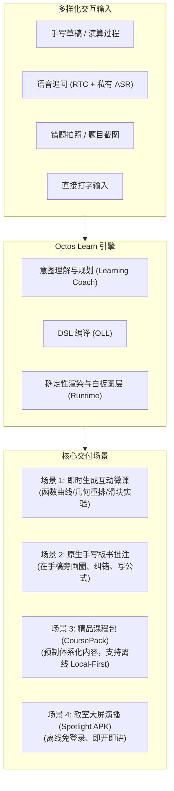
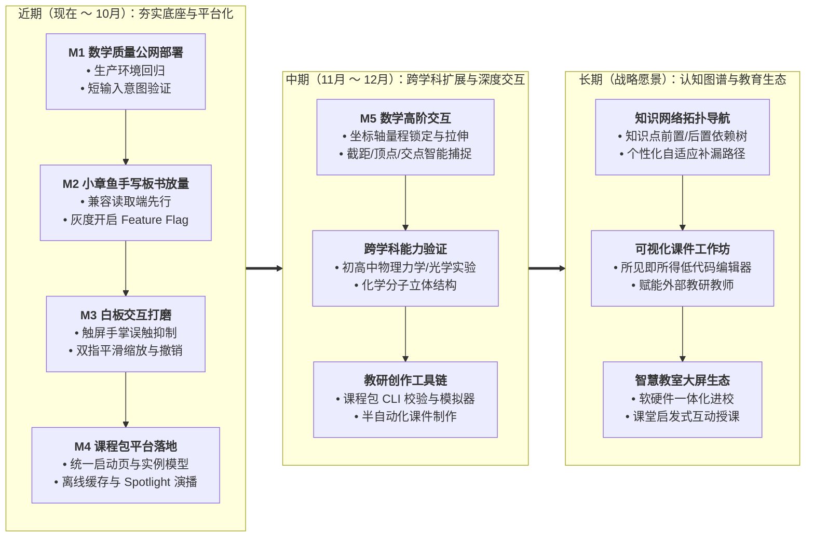

# Octos Learn

---

## 一、产品愿景与核心定位

### 1.1 背景：AI 改变教育的底层逻辑
传统教育受限于师资与资源分配，难以兼顾规模化与个性化。AI 正在两个根本维度重构教育方式：
1. **知识获取的边际成本归零、耐心无限**：学生可以从任何切入点、以任何步频向 AI 提问；AI 具备无穷的耐心，消除了学生“问蠢问题”的心理羞怯与挫败感；答案不再需要辗转于书本、搜索与论坛之间，而是由 AI 实时结构化地呈现在眼前。
2. **知识组织形式由“单一线性”走向“动态网状”（因材施教）**：每个学生理解知识的最佳路径截然不同。通过构建多维知识图谱（前置概念、推演分支、验证练习），AI 能评估学习反馈并动态规划最优路径。

### 1.2 产品定位
**Octos Learn（小章鱼学习）是一个 AI 原生驱动的无限白板自适应学习产品。**  
学生在白板上通过手写、语音、文字或拍照提出数学/科学问题，AI 老师（产品人格为“小章鱼”）实时在白板上动态构建带有**确定性交互画面（函数图象、几何动画、动态滑块）、手写体板书批注与同步语音旁白**的沉浸式微课程。

- **产品形态**：Web（[learn.pitun.cc](https://learn.pitun.cc)）+ Android 独立客户端（极低系统门槛 Android 8.0+，覆盖低成本学习平板）。
- **用户画像**：自学学生（中小学及自考数学为主）、备课与课堂演示教师、会议/教培大屏演示场景。
- **商业与成本模型**：
  - **BYOK (Bring Your Own Key)**：用户自带主流大模型 API Key（Gemini / Ark 等），平台不承担高昂的 LLM 推理账单，保障项目无边际服务器成本负担。
  - **平台池按需代付**：针对旁白语音（TTS）等轻量感知链路，由平台提供免配置的额度兜底（hosted-tts 托管语音服务）。

---

## 二、核心产品哲学与工程铁律

1. **速度是第一体验硬门槛（Speed is a Hard Constraint）**
   - 教学交互容忍度极低，任何功能或架构改动**严禁回退首个可播放片段的生成延迟（p50）**。
   - 坚持“交错基线渲染”，严格控制零新增额外模型往返（Round-trips）。
2. **模型负责理解，程序保证数学正确（Deterministic Runtime）**
   - 彻底解决大模型在理科教学中的“一本正经胡说八道（幻觉）”问题。
   - 自研 **OLL (octos-lesson-language)**：LLM 仅负责理解学生意图并编译为 OLL 结构化 DSL，白板底层 Runtime 负责严谨的几何与代数计算、坐标轴比例尺绘制及状态流转。
3. **空间融合与手势自然交互（Spatial Native）**
   - 拒绝传统的侧边栏聊天框问答。白板就是草稿纸与黑板的结合体，AI 生成的板书、互动卡片直接在学生的手稿旁避让生成、连线批注。

---

## 三、核心应用场景

1. **自适应白板探究课**：针对疑难概念（如“斜率与截距的关系”、“二次函数平移”），AI 实时拉出可拖拽滑块的动态图象，边讲边动。
2. **草稿纸智能伴读批注**：学生在白板上做题，框选手迹后 AI “小章鱼”直接以手写笔迹在手稿右侧/下方划重点、指正逻辑漏洞并补齐步骤。
3. **不可变精品课程集（CoursePack）**：体系化、经教研人工编辑验证的系列微课，保证核心教学内容的高质稳定。
4. **离线教学演示（Spotlight 模式）**：教室断网或弱网环境下，通过专用 APK 直接播放本地内置的高清交互课件。

---

## 四、系统架构与技术栈现状

### 4.1 多仓库职责边界
| 仓库 | 核心技术栈 | 职责边界 |
|---|---|---|
| **`octos-learn`** | React 19, TS, Vite 7, Tailwind 4, js-draw, Agora RTC | 独立产品前端、白板渲染、hosted-tts 托管语音服务、Android 打包与公网部署脚本 |
| **`octos`** | Rust (Axum, Tokio) | 通用服务端底座：用户认证、Profile 数据隔离、模型路由调度、WebSocket 会话与文件系统 |
| **`learning-coach`** | Node.js, TypeScript | 教学意图理解核心：将自由提问翻译为教学大纲、纠错并编译交付 OLL 课程 DSL |
| **`octos-lesson-language`** | TypeScript, MathJS, KaTeX | OLL 规范制定者与确定性 Runtime：负责图形学计算、动画播放、手势操控契约 |
| **`octos-course-library`** | TS, 静态构建脚本 | 精品课程包的创作、单体构建与不可变版本化分发目录 |
| **`agora-sensevoice-demo`** | Python, SenseVoice, Agora RTC | 毫秒级低延迟私有语音 ASR，提供高精度的声学听写能力 |

### 4.2 功能模块落地现状表
| 模块分类 | 核心功能点 | 当前落地状态 | 下一步推进要求 |
|---|---|---|---|
| **基础底座与部署** | 独立抽取、VPS+Nginx 部署、邮箱验证码注册、多用户隔离 | ✅ **线上稳定运行** | Slice 6: 下线旧 `octos-web` 冗余入口 |
| **成本与服务** | BYOK 密钥绑定、私有 ASR 接入、Hosted-TTS 平台额度代付池 | ✅ **线上稳定运行** | ASR 多 Worker 负载调度（待流量验证后开启） |
| **数学教学质量 (M1)** | 真实坐标轴、动态视窗、圆面积扇形切拼、双点斜率、短意图理解、67项基线评测 | ✅ **代码已合并** | 待公网发布验证，执行生产环境回归清单 |
| **手写板书批注 (M2)** | `board_writing` AI 笔迹上板、超时防挂死屏障、卡片与板书避让、关联指示箭头 | ✅ **代码已合并进 main** | 由 Feature Flag 灰度控制，待生产环境开启 `VITE_ENABLE_BOARD_WRITING=true` |
| **白板手势与交互 (M3)** | 双指缩放平移、多指针并发处理、防手掌误触、长按区域圈选、全局 Undo/Redo | 🔶 **部分合入中** | 收尾 P4~P7，解决部分 Android 设备手势跳变 |
| **课程包平台 (M4)** | 启动页入口分流、不可变包分发、`CourseInstance` 进度模型、APK 离线 LRU | 🔶 **方案已定稿** | 推进平台契约实现，落地 Local-First 离线播放 |
| **精品内容资产** | 面积切片课 (0.1.5)、斜率与截距 (0.1.6)、线性函数三课合辑 | 🔶 **分支评审中** | 待人工教研审核通过后发布入库 |

---

## 五、未来规划路线图（Roadmap）

### 5.1 近期里程碑（聚焦核心体验收敛与首发闭环）

#### M1 · 数学质量专项公网交付（P0 最高优先级）
- **目标**：将已合并的坐标系、几何重排、视窗自适应及短意图推理优化推向生产环境。
- **验收准则**：自然输入测试集通过率 ≥ 95%；首包播放延迟 p50 不得发生退化；短输入与完整输入的一致性差值 ≤ 5%。

#### M2 · 小章鱼原生手写板书（`board_writing`）公网放量
- **现状**：核心代码已合并至 `main`（提交 `692f143`），并在 PR #12、PR #14 中完成进一步体验与交互打磨。
- **发布步骤**：目前由 Feature Flag 控制（默认未开），待验证旧白板数据的向前兼容读取无损后，在生产环境开启 `VITE_ENABLE_BOARD_WRITING=true` 即可全量面向用户生效。
- **后续储备**：逐笔笔划书写动画、手写数学排版引擎（根号、分数线优化）。

#### M3 · 白板触控原生交互体验收尾
- 完成 P1~P7 交互专项（聚焦平板手写笔与手指配合体验）：
  - 完善防手掌误触（Palm Rejection）与触控板捏合平滑曲线。
  - 完善触屏长按快捷框选与画板级全局撤销（Ctrl+Z / 撤销手势）。

#### M4 · 课程包平台（CoursePack Platform）落地
- **统一信息架构启动页 (`/`)**：
  - 打开即见两项顶层入口：“选择精品微课探索” 与 “新建空白白板自由提问”。
- **学习实例模型 (`CourseInstance`)**：
  - 建立不可变课包（`CoursePack`）与学生进度实例（`CourseInstance`）的分离，支持随时“继续上次进度”或“重置重新探索”。
- **Android 端 Local-First 离线运行**：
  - 标准 APK 具备课包下载校验与 LRU 缓存，断网即可流畅互动。
  - 打造针对教研演示的独立 flavor：**Spotlight APK**（构建期固化课包、无需登录、极简沉浸启动）。

---

### 5.2 中期规划（横向跨学科与纵向交互深度）

1. **跨学科能力探索（理化生拓展）**
   - 检验 OLL 的跨领域抽象能力：目前证明了其在几何代数上的精准表达，接下来将向**初高中物理（力学平衡、光学折射反射、电路串并联）**和**化学（分子空间构型、反应平衡）**拓展确定性组件。
2. **数学第二阶段深度特性（M5）**
   - 提供更灵活的函数卡片控制：支持小/标准/大尺寸切换；坐标轴手动量程锁定、等比例锁、关键点（截距、顶点、交点）几何捕捉与标注。
3. **半自动化课程制作工作流**
   - 提供更加健壮的 CLI 课程打包、语法 Lint 与真机模拟器，为外部教研老师贡献精品课打好工具基础。

---

### 5.3 长期愿景（产品终局）

1. **多维知识网络与因材施教自适应引擎**
   - 摆脱传统的章节目录形式。将各学科知识点打散为拓扑图谱（DAG）。
   - 系统根据学生的提问频次、解题用时、互动滑块探究数据，动态评估认知缺口，自动推荐下最佳前置/递进微课。
2. **平民化可视化创作工作台（Course Studio）**
   - 打造所见即所得的课件创作器，让一线优秀教师不用手写 DSL 代码，也能拖拽生成高质量的 OLL 交互课件。
3. **智慧教室与大屏教具深度融合**
   - 探索产品从“个人课后学习终端”延伸为“课堂老师启发式授课神器”，与学校电子白板大屏软硬件生态形成互补。

