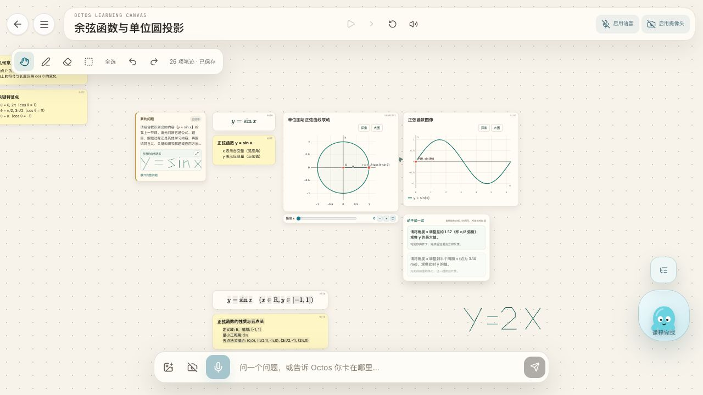
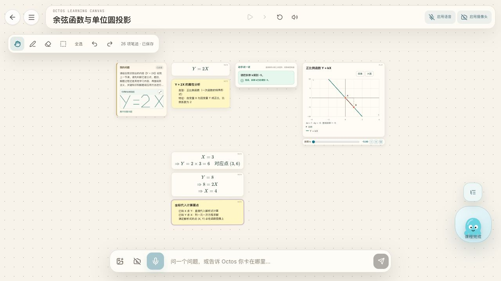

# da08658 练习顺序与锁定提示复测 — 2026-10-09

被测分支 `codex/pack-generated-lesson-keeps-progress`，提交 `da0865804a59e67cb6affeca08b6be44bbebd0e2`。本轮复用上一轮保留的确切会话 `learn-1791562126580-46n45l`，其中两节生成课均由上一轮真实 BYOK 生成。本轮没有再次调用模型：在新代码下恢复同一批未完成练习，并重播最后一节生成课，核对播放期间与全部完成后的两种提示，再逐题完成。这能直接复测上一轮被误判的现场，但不是新建会话重新生成两节课的测试。

**更正上一轮结论：生成课练习等待前题完成，符合 OLL 的整块白板顺序规则；撤回“全部播放完成后生成课练习仍锁定”的失败判定。** 本次四道练习均能依次开放和成功，提示及成功状态刷新后保留。另有一项实际失败：完成余弦练习后，五个预制课节点下移 16 个白板单位。

## 逐项结果

| 用户检查项 | 结果 | 实际表现 |
|---|---|---|
| 1. 全部播完后的提示、逐题开放和判分 | **通过** | 预制课题可操作，生成课题提示先完成余弦课练习。随后依次完成余弦 1.57、正弦 1.57、正弦 3.14、斜率 -5，四题都为 is-succeeded。 |
| 2. 新课播放期间旧练习提示 | **通过** | 重播最后一节生成课时，旧余弦与正弦练习锁定，文字仍为“白板上的课程全部播放完后，就可以继续操作。” |
| 3. 面板和预制课节点坐标无位移 | **失败** | 三个面板 left/top/width 始终不变；但余弦练习成功后，五个预制课节点 top 增加 16，刷新后仍是新坐标。 |
| 4. 刷新保留状态和提示 | **通过** | 每完成一道题后分别刷新。四组 before/after 的面板位置、任务状态、aria-disabled、反馈文字逐项一致，最终四题成功状态也保留。 |

Console 完整 warn/error 记录为 `[]`：[console-warn-error.json](console-warn-error.json)。无 OLL_PLAYBACK_AFTER_CLOSE、课程追加已暂停、checkpoint / restore 相关报错。

## 逐题实测

课程依次为：余弦预制课（4 步）、“正弦函数 y = sin x 的概念与图像解析”（2 步）、“正比例函数与一次函数基础：理解 Y = 2X”（2 步）。所有操作均使用实际鼠标拖动滑块，未注入应用状态或修改课程。

| 阶段 | 余弦题 | 正弦第 1 题 | 正弦第 2 题 | Y=2X 题 |
|---|---|---|---|---|
| 全部播完，开始做题前 | 可操作 | 锁定：先完成余弦课练习 | 锁定：先完成余弦课练习 | 锁定：先完成余弦课练习 |
| 余弦 θ 拖到 1.57 | 成功 | 可操作 | 锁定：先完成前面的练习 | 锁定：先完成正弦课练习 |
| 正弦 x 拖到 1.57 | 成功 | 成功 | 可操作 | 锁定：先完成正弦课练习 |
| 正弦 x 拖到 3.14 | 成功 | 成功 | 成功 | 可操作 |
| 斜率 k 拖到 -5 | 成功 | 成功 | 成功 | 成功 |

相关提示完整文本：

- 跨课排队：`先完成「余弦函数与单位圆投影」里的练习，这一题就会开放。`
- 同课排队：`先完成前面的练习，这一题就会开放。`
- 后一课排队：`先完成「正弦函数 y = sin x 的概念与图像解析」里的练习，这一题就会开放。`
- 播放期间：`白板上的课程全部播放完后，就可以继续操作。`

完成余弦题后，正弦第一题开放，滑块随后准备为 0；完成正弦第一题后也准备为 0，供第二题操作。判定成功以各题 is-succeeded 和反馈为准，未把下一题准备时的数值复位当成练习失败。

证据：[初始排队状态](01-all-completed-queued.json)、[播放期间](02-generated-playing.json)、[余弦成功后](04-pack-task-succeeded.json)、[正弦第一题成功后](06-sine-first-succeeded.json)、[正弦第二题成功后](08-sine-second-succeeded.json)、[全部成功](10-all-tasks-succeeded.json)。

## 失败详情：完成余弦练习后节点下移 16

课程：“余弦函数与单位圆投影”，练习所在第 4/4 步。触发操作：所有课程播完后，将预制课旋转角 θ 从 6.28 拖到约 1.57，任务判定成功。

预期：成功反馈和后题解锁期间，预制课节点位置不变。

实际：预制课练习面板位置保持 `(476, 408)`，高度由 **152 增至 168**；其后五个预制课节点全部向下移动 **16**。后续做完所有题及每次刷新后，这五个节点维持移动后的坐标，未继续累积位移。单位圆、余弦图本身不动，所有七个节点的 left/width/height 均不变。

该现象与成功反馈的高度增加同幅度，提示可能涉及布局预留高度，但本轮没有定位根因、修改产品或做旧提交对照，不能判定由 da08658 引入。

下面是白板世界坐标，读取同一 data-id 节点的行内样式；before 是完成余弦题之前，after 是四题全成功并最终刷新之后。屏幕镜头平移、缩放不参与此比较。

| 节点 | before (left, top, width, height) | after (left, top, width, height) | top 变化 |
|---|---|---|---|
| 单位圆 | (20, 20, 440, 380) | (20, 20, 440, 380) | +0 |
| 余弦图 | (476, 20, 440, 360) | (476, 20, 440, 360) | +0 |
| 正弦与余弦曲线对比 | (20, 596, 440, 360) | (20, 612, 440, 360) | +16 |
| 正余弦公式 | (488, 596, 268, 72) | (488, 612, 268, 72) | +16 |
| 诱导公式 | (488, 684, 268, 72) | (488, 700, 268, 72) | +16 |
| 余弦函数的几何意义 | (796, 596, 440, 114) | (796, 612, 440, 114) | +16 |
| 余弦曲线的关键特征点 | (796, 726, 440, 135) | (796, 742, 440, 135) | +16 |

原始证据：[前后节点对照](prepack-node-comparison.json)、[完成余弦题前](03-completed-before-first.json)、[成功后](04-pack-task-succeeded.json)、[全部成功并刷新后](11-all-succeeded-after-refresh.json)。Console 无错误。

## 三个练习面板坐标

| 面板 | before (left, top, width) | 每道题解锁后及刷新后 | 位置变化 |
|---|---|---|---|
| 余弦预制课 | (476, 408, 330) | (476, 408, 330) | 0 |
| 正弦生成课 | (2434, 1216.9, 330) | (2434, 1216.9, 330) | 0 |
| Y=2X 生成课 | (4347.89, 1571.55, 330) | (4347.89, 1571.55, 330) | 0 |

面板文本变化伴随实际高度变化，未声称高度固定：

| 做题阶段 | 余弦面板高度 | 正弦面板高度 | Y=2X 面板高度 |
|---|---:|---:|---:|
| 尚未完成任何题 | 152 | 287 | 147 |
| 完成余弦题 | 168 | 255 | 147 |
| 完成正弦第一题 | 168 | 257 | 147 |
| 完成正弦第二题 | 168 | 273 | 131 |
| 四题全部成功 | 168 | 273 | 134 |

完整各阶段坐标：[panel-position-stages.json](panel-position-stages.json)。

## 刷新对照与验证范围

四组刷新前后 JSON 的 panels 数组逐项相等（含文字、状态、禁用标记、坐标和实际高度）：

- [余弦成功后、刷新前](04-pack-task-succeeded.json) / [刷新后](05-pack-succeeded-after-refresh.json)。
- [正弦第一题成功后](06-sine-first-succeeded.json) / [刷新后](07-sine-first-after-refresh.json)。
- [正弦第二题成功后](08-sine-second-succeeded.json) / [刷新后](09-sine-second-after-refresh.json)。
- [全部成功](10-all-tasks-succeeded.json) / [最终刷新](11-all-succeeded-after-refresh.json)。

独立执行 `pnpm test:unit`：118 文件，**1131/1131 通过**，退出码 0；`pnpm exec tsc -b --pretty false`：退出码 0，无错误。没有重复此前已测的主流程/B/C–F，没有重新运行全部 Playwright，也没有部署公网。报告、截图与原始 DOM/坐标证据均提交同一 Git 分支，不含本机访问地址。
