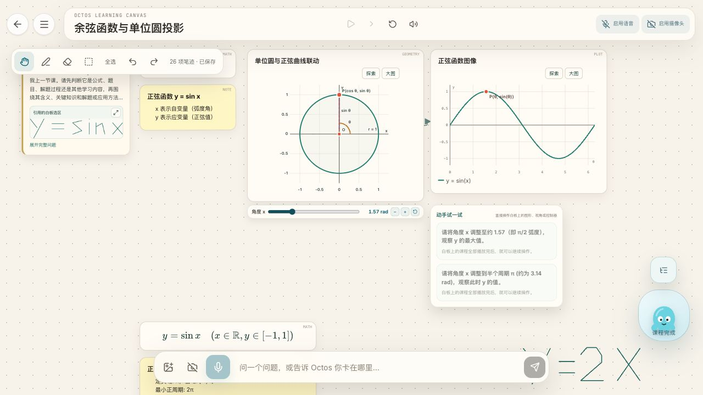

# db680e3 真实 BYOK 复测 — 2026-10-09

被测代码：`codex/pack-generated-lesson-keeps-progress`，`db680e35ed1fe4d0d014e1558f394ef9b5cd5199`。新建四个会话，使用已有真实 BYOK；未改模型配置、课程 DSL 或产品代码。本报告与截图提交同一分支，不含本机访问地址。

布局修复通过：正弦课 6 个节点、余弦课 7 个节点的 left/top/width/height 均保持不变；原先 139、118 单位的上移本轮均为 0。发现一项失败：在余弦课追加两节生成课后，全部显示“课程完成”，生成课的练习仍锁定，刷新也不能解锁。预制课练习正常解锁，另一个纯生成会话的练习也正常解锁。

## 逐项结果

| 项目 | 结果 | 实测 |
|---|---|---|
| 主流程：预制课播完后解释手写 y = sin x | 通过 | 正弦预制课自然播完；手写、框选、点击“解释这部分”；生成课“正弦函数 y = sin x 的图像与性质”接着播放，旁白文本属于新课，旧板书保留。 |
| 布局一：正弦预制课追加新课 | 通过 | 六个旧节点全部不变，总结卡片 top 617 → 617。 |
| 布局二：余弦预制课连续追加两节新课 | 通过 | 两次问题分别识别为 y = sin x、Y = 2X；第二次生成前后七个预制课节点全部不变。 |
| 新课播放期间旧练习锁定 | 通过 | 预制课面板一直可见、半透明、aria-disabled=true，并显示指定提示。纯生成课里实际拖动旧滑块至 1.57 后仍为 in_progress、尝试次数保持 1，提示和重新开始按钮禁用。 |
| 全部播完后练习自动解锁 | **失败** | 预制课及纯生成会话的旧练习能解锁；但余弦混合会话的生成课练习仍锁定，详见下文。 |
| 想一想保留且可展开 | 通过 | 纯生成会话追加新课期间，旧反思卡仍在；查看答案可点，能显示答案。 |
| 预制课重播时练习先收起、结尾重现 | 通过 | 在目录查看预制课最后一步后点顶部重播，开始时无练习面板；用“下一 OLL Beat”推进至该课末尾，面板重新出现。 |
| A：预制课独立播放完成 | 通过 | 两节预制课均从头自然播放至“课程完成”，不卡末尾。“下一课”不作为检查项。 |
| B1：生成课第 2 步刷新 | 通过 | 刷新后仍在生成课“总结并运用 y = sin x 的核心性质……”第 2 步；预制课旋转角保留非零值 1.57，没有预制课开场文本。 |
| B2：余弦第 2/4 步暂停 → 两节生成课 → 完成 → 刷新 | 通过 | 初始暂停第 2 步，生成正弦课，再生成 y = 2x；终态显示完成。刷新后在最后一节生成课“探究正比例函数 y = 2x 的图象、斜率特征与画法”，旋转角仍为 6.28，没有回到预制课第 1 步。末段会继续播放，符合“完成状态或停在最后一节生成课”的预期。 |
| C：连续生成 | 通过 | 第二节新课属于“正比例函数与一次函数基础：理解 Y = 2X”，从新课步骤接续，未重播预制课或第一节生成课。 |
| D：预制课中途提问 | 通过 | 余弦第 2/4 步暂停后手写框选 y = sin x；继续后进入新正弦课，没有从预制课第 1 步开始。 |
| E：生成课顶部重播 | 通过 | 重播进入“正弦函数 y = sin x 的概念与图像生成”的第一步；旧余弦课板书仍在、旋转角 6.28，未整体重播白板。 |
| F / 纯生成会话 | 通过 | 无预制课；生成带反思的正比例课、带练习的正弦课，再追问 y=2x。旧七个节点不动；旧练习在后课播放期间锁定，全部结束后可获取提示、重新开始，实际拖到 1.57 后成功。 |

## 失败详情：生成课练习在全部完成后没有解锁

会话标识：`learn-1791562126580-46n45l`。

1. “余弦函数与单位圆投影” (`trig-cosine-and-phase-shift@0.1.4`) 播完 4/4 步。
2. 手写框选 `y = sin x`，解释生成“正弦函数 y = sin x 的概念与图像解析”（2 步）。
3. 再手写框选 `Y = 2X`，解释生成“正比例函数与一次函数基础：理解 Y = 2X”（2 步）。
4. 全部完成、当前指向最后一节生成课第 2 步后，预制课练习已解锁，但正弦生成课的两项练习仍是 `is-not_started is-locked`、`aria-disabled="true"`；最后一节生成课的“请把斜率 k调到 -5。”也仍锁定。
5. 刷新后仍显示“课程完成”，目录仍指向最后一节生成课第 2 步，上述锁定状态持续。实际拖动第一节生成课角度 x 到 **1.57** 后，任务仍未开始、未成功。

预期：白板课程全部播放结束后，这些练习自动解锁，拖动至目标应能判定完成。

实际提示完整文本：`白板上的课程全部播放完后，就可以继续操作。`

Console：**无 warn/error**，也无 `OLL_PLAYBACK_AFTER_CLOSE`、“课程追加已暂停”、checkpoint / restore 报错。完整记录见 [console-warn-error.json](console-warn-error.json)。

生成课标识：正弦 `edc3cffb-dd62-488e-bfb1-cd5deb51fa1e`；Y=2X `f3a88797-df49-4285-98bd-3f1d503d10c3`。这项失败是否来自本提交，尚未做旧提交对照；不能据此判定是本提交引入。

证据：[刷新前完成态](cosine-all-completed.dom.txt)、[刷新后仍锁定的 DOM](failure-after-refresh.dom.txt)、[刷新后任务状态](failure-generated-practice-after-refresh.json)、[到达目标仍锁定](failure-locked-task-after-drag.json)。

## 节点坐标 before / after

下面均为白板世界坐标，直接读取相同 `data-id` 节点的行内 left/top/width/height，单位与 CSS px 一致。不是屏幕坐标；自动镜头缩放不算节点位移。原始 JSON 保留完整节点 ID。

### 正弦预制课

生成前取预制课自然完成画面，生成后取新课播放画面。

| 节点 | before (left, top, width, height) | after (left, top, width, height) | Δ |
|---|---|---|---|
| 单位圆 | (20, 20, 440, 380) | (20, 20, 440, 380) | 全部 0 |
| 正弦图 | (476, 20, 440, 360) | (476, 20, 440, 360) | 全部 0 |
| P 坐标公式 | (944, 20, 240, 72) | (944, 20, 240, 72) | 全部 0 |
| 正弦值的几何意义 | (944, 108, 240, 135) | (944, 108, 240, 135) | 全部 0 |
| y=sin θ 公式 | (944, 283, 240, 72) | (944, 283, 240, 72) | 全部 0 |
| 正弦函数 y=sin x 的性质 | (20, 617, 302.4, 135) | (20, 617, 302.4, 135) | 全部 0 |

证据：[完整节点对照](sine-node-comparison.json)、[生成前](sine-completed-before.jpg)、[生成后及锁定面板](sine-new-course-locked.jpg)。

### 余弦预制课

before 取第一节生成课完成、第二次请求发出前；after 取第二节生成课播放期间。另有最初预制课完成时的基线，三次坐标均一致。

| 节点 | before (left, top, width, height) | after (left, top, width, height) | Δ |
|---|---|---|---|
| 单位圆 | (20, 20, 440, 380) | (20, 20, 440, 380) | 全部 0 |
| 余弦图 | (476, 20, 440, 360) | (476, 20, 440, 360) | 全部 0 |
| 正弦与余弦曲线对比 | (20, 596, 440, 360) | (20, 596, 440, 360) | 全部 0 |
| 正余弦公式 | (488, 596, 268, 72) | (488, 596, 268, 72) | 全部 0 |
| 诱导公式 | (488, 684, 268, 72) | (488, 684, 268, 72) | 全部 0 |
| 余弦函数的几何意义 | (796, 596, 440, 114) | (796, 596, 440, 114) | 全部 0 |
| 余弦曲线的关键特征点 | (796, 726, 440, 135) | (796, 726, 440, 135) | 全部 0 |

证据：[第二次生成前节点](cosine-before-second-nodes.json)、[第二次生成后节点](cosine-after-second-nodes.json)、[对照 JSON](cosine-node-comparison.json)、[第二节生成课播放目录](cosine-second-playing.jpg)。

### 纯生成会话的旧节点

此会话首节正比例课虽明确请求练习，但实际输出仅含反思、没有任务。因此增加了一节带任务的正弦课，再追加 y=2x 课，实测带任务旧课的锁定与解锁。以下比较第三节请求前后已经存在的七个节点。

| 节点 | before (left, top, width, height) | after (left, top, width, height) | Δ |
|---|---|---|---|
| 正比例课公式 | (537.949, 279.615, 113, 72) | (537.949, 279.615, 113, 72) | 全部 0 |
| 正比例函数图 | (678.949, 279.615, 440, 385) | (678.949, 279.615, 440, 385) | 全部 0 |
| 正比例性质卡 | (1146.95, 279.615, 432, 135) | (1146.95, 279.615, 432, 135) | 全部 0 |
| 正弦课单位圆 | (2111.98, 90, 440, 380) | (2111.98, 90, 440, 380) | 全部 0 |
| 正弦图 | (2567.98, 90, 440, 360) | (2567.98, 90, 440, 360) | 全部 0 |
| 正弦公式 | (3035.98, 90, 248.4, 72) | (3035.98, 90, 248.4, 72) | 全部 0 |
| 单位圆与正弦值卡 | (3035.98, 178, 248.4, 135) | (3035.98, 178, 248.4, 135) | 全部 0 |

练习面板位置/宽度 `(2567.98, 478, 330)` 不变；反思卡位置/宽度 `(1146.95, 430.615, 432)` 不变。展开答案及显示提示会改变卡片文本高度，不以屏幕截图高度判定世界坐标位移。

证据：[旧节点对照](pure-node-comparison.json)、[实际拖动但不计分的锁定状态](pure-locked-after-drag.json)、[锁定期间答案可展开](pure-reflection-answer-while-locked.jpg)、[解锁后获取提示](pure-unlocked-hint.jpg)、[实际拖动后成功](pure-unlocked-completed-task.jpg)。

## 刷新加载与回归证据

| 场景 | 最近一次未见播放器 | 首次见播放器 | 结果 |
|---|---:|---:|---|
| B1 | 490 ms | 553 ms | 生成课第 2 步恢复 |
| B2 中途提问会话 | 428 ms | 485 ms | 最后一节生成课恢复 |
| 补充：预制课完整播放后连续生成两节 | 488 ms | 564 ms | 保持完成状态、最后一节第 2 步 |

计时从发起刷新算到播放器重播按钮进入 DOM，含导航、资源加载和会话加载，是本次采样区间，不是精确拆分的异步等待耗时。

- B1：[刷新前](B1-before-refresh.jpg)、[刷新后](B1-after-refresh.jpg)、[加载采样](B1-loading-timing.json)。
- B2：[刷新前](B2-before-refresh.jpg)、[刷新后](B2-after-refresh.jpg)、[加载采样](B2-loading-timing.json)。
- 补充完整播放会话：[刷新前](B2-full-before-refresh.jpg)、[刷新后](B2-full-after-refresh.jpg)。
- D：[暂停第 2 步](D-paused.jpg)、[进入生成课](D-continued-course.jpg)。
- E：[仅重播生成课](E-generated-replay.jpg)、[目录与旁白文本](E-generated-replay.dom.txt)。
- 预制课重播：[开始无练习](pack-replay-start.jpg)、[结尾练习重现](pack-replay-panel-returned.jpg)。

## 验证范围

- 实跑 `pnpm test:unit`：118 文件、1130/1130 通过，退出码 0。
- 实跑 `pnpm exec tsc -b --pretty false`：退出码 0，无 TypeScript 错误。
- 真实 BYOK 共生成八节课程：正弦主场景 1、余弦完整播放场景 2、中途提问场景 2、纯生成场景 3。新建会话排除旧存档一次性重播影响。
- 两节预制课首轮从头自然播完；部分重播/末段回归使用产品“下一 OLL Beat”推进。B2 中途会话中额外做过当前生成课重播，用于 E，再追加第二节课。
- 本轮用可见旁白文本和目录确认讲解归属，没有听音频来验证声音内容。E 重播曾显示“课程语音暂时不可用，旁白仍会显示。”；Console 无对应错误，未排查 TTS 服务。
- 没有重复运行 Claude 已报告的 39 个 Playwright 用例，没有复测 main 的微积分滑块/3D 间距问题，没有部署公网。上述单元测试与类型检查是本轮独立执行结果。
